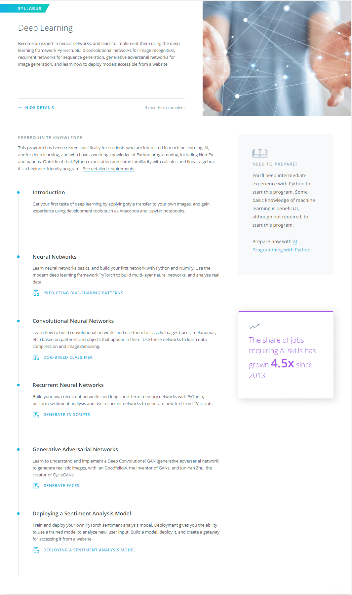

# [Udacity Deep Learning Nanodegree](https://www.udacity.com/course/deep-learning-nanodegree--nd101) 

#### Become a Computer Vision Expert

Master building and implementing neural networks for image recognition, sequence generation, image generation, and more.

## What You Will Learn.

## [Syllabus pdf](https://d20vrrgs8k4bvw.cloudfront.net/documents/en-US/Deep+Learning+Nanodegree+Syllabus+8-15.pdf)
